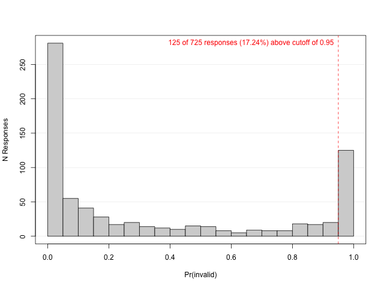

# whocaresnot

<!-- badges: start -->
<!-- badges: end -->

This package implements a factor mixture model (FMM) based approach to
the detection inconsistent responding to multi-item scales including
items with different semantic polarity (i.e., reverse-coded items),
using OpenMx and requiring minimal user input.

Based on the approach described in:

Arias, V. B., Garrido, L. E., Jenaro, C., Martínez-Molina, A., & Arias,
B. (2020). A little garbage in, lots of garbage out: Assessing the
impact of careless responding in personality survey data. Behavior
Research Methods, 52(6), 2489–2505.
<https://doi.org/10.3758/s13428-020-01401-8>

## Installation

You can install the development version of whocaresnot from
[GitHub](https://github.com/) with:

``` r
# install.packages("devtools")
devtools::install_github("damiencrone/whocaresnot")
```

## Example

This is a basic example using the data presented in Arias et al. (2020)
available at <https://osf.io/n6krb>.

``` r
library(whocaresnot)
#> Loading required package: OpenMx
#> OpenMx may run faster if it is compiled to take advantage of multiple cores.
library(haven)
```

``` r
# From https://osf.io/n6krb
dat = read_sav("~/Downloads/raw_data_and_MPlus_code/DATA_SAMPLE_1.sav")
```

``` r
ov = c(paste0("E", 1:6, "_P"), paste0("E", 1:6, "_N"))
reversed = paste0("E", 1:6, "_N")
head(dat[, ov])
#> # A tibble: 6 × 12
#>             E1_P    E2_P    E3_P    E4_P    E5_P    E6_P    E1_N    E2_N    E3_N
#>        <dbl+lbl> <dbl+l> <dbl+l> <dbl+l> <dbl+l> <dbl+l> <dbl+l> <dbl+l> <dbl+l>
#> 1 5 [Very accur… 5 [Ver… 5 [Ver… 4 [Mod… 5 [Ver… 5 [Ver… 5 [Ver… 5 [Ver… 5 [Ver…
#> 2 1 [Very inacc… 3 [Nei… 3 [Nei… 2 [Mod… 3 [Nei… 4 [Mod… 1 [Ver… 2 [Mod… 1 [Ver…
#> 3 1 [Very inacc… 2 [Mod… 1 [Ver… 3 [Nei… 3 [Nei… 4 [Mod… 1 [Ver… 2 [Mod… 1 [Ver…
#> 4 4 [Moderately… 4 [Mod… 5 [Ver… 4 [Mod… 4 [Mod… 4 [Mod… 4 [Mod… 5 [Ver… 5 [Ver…
#> 5 1 [Very inacc… 4 [Mod… 4 [Mod… 4 [Mod… 5 [Ver… 3 [Nei… 1 [Ver… 3 [Nei… 2 [Mod…
#> 6 2 [Moderately… 1 [Ver… 4 [Mod… 4 [Mod… 5 [Ver… 1 [Ver… 4 [Mod… 1 [Ver… 4 [Mod…
#> # … with 3 more variables: E4_N <dbl+lbl>, E5_N <dbl+lbl>, E6_N <dbl+lbl>
#> # ℹ Use `colnames()` to see all variable names
```

``` r
model = construct_model(data = dat, ov, reversed)
```

``` r
fit = estimate_model(model, try_hard = TRUE)
#> Running Factor Mixture Model with 52 parameters
#> 
#> Beginning initial fit attempt
#> Running Factor Mixture Model with 52 parameters
#> 
#>  Lowest minimum so far:  24878.1327114483
#> 
#> Solution found
```

    #> 
    #>  Solution found!  Final fit=24878.133 (started at 32626.488)  (1 attempt(s): 1 valid, 0 errors)
    #>  Start values from best fit:
    #> 0.00863074397148227,0.0034856332260142,0.510811917838225,0.579075959106426,0.691319365884972,0.410151055193747,0.50119736629227,0.671040653753088,0.64321805522045,0.80675657394644,0.787510945595198,0.645002086520486,0.513101002469307,0.771436486456446,0.838281149842611,2.43845005128983,3.1283914510024,2.9196126874844,2.88513408122369,3.10230575286693,3.23819680461909,2.31656684500183,3.32444529999826,2.97906646919454,3.14598265409291,3.23443279307483,3.44542749709087,1.70333243771475,1.20456553894684,1.78531845238204,1.13508114024064,1.7132393032458,1.17384971266783,1.32470758825695,1.64102608950959,1.29243123983738,1.58928528078715,1.80432022233235,1.45113770873113,0.161081515513864,2.42945548771911,3.66019203885899,2.94013876842548,3.21250105593094,3.35079970754991,3.58488577171316,1.9305484678785,3.3473502580995,2.44771391778215,2.84469955644486,3.22981051311598,3.50327662558232
    probs = get_class_assignment_probabilities(fit)

``` r
png(filename = "files/cdf.png", height = 480, width = 640)
plot_decision_threshold(probs)
dev.off()
```


``` r
png(filename = "files/prob_hist.png", height = 480, width = 640)
plot_assignment_probability_distribution(probs)
dev.off()
#> quartz_off_screen 
#>                 2
```



``` r
head(get_responses(data = dat[, ov], probs))
#>     prob_invalid E1_P E2_P E3_P E4_P E5_P E6_P E1_N E2_N E3_N E4_N E5_N E6_N
#> 312            1    5    5    5    5    5    5    1    1    1    2    1    1
#> 398            1    5    5    5    5    5    5    1    5    1    1    1    1
#> 717            1    5    5    5    5    3    4    3    1    1    1    1    1
#> 597            1    4    5    5    5    5    5    1    2    1    1    2    1
#> 640            1    5    5    5    5    5    4    1    2    1    2    1    2
#> 505            1    5    5    4    5    5    5    1    1    2    1    2    2
```
